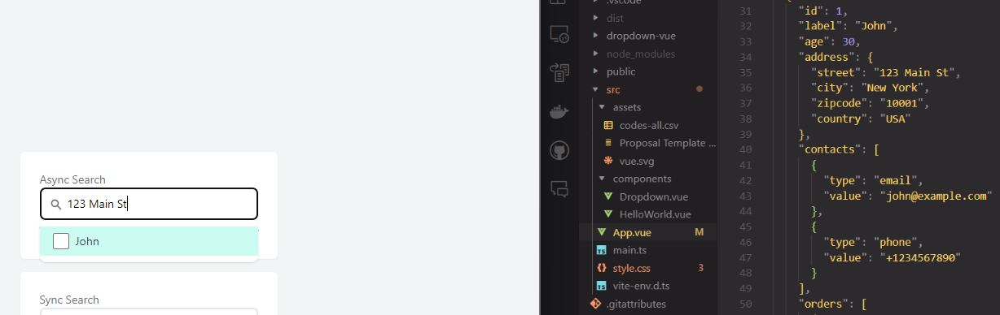

# Built with Vue 3 + Typescript + Vite

Take home assignment by Beep Technology, to complete a fully featured search dropdown component.

Frontend Framework: Vue.js
CSS: TailwindCSS
Other dependencies used: NIL

## Features

- [x] Configurable input label, synchronous/asynchronous search, json input and search key, custom transformFunction to transform the query
- [x] Mouse navigation
- [x] Keyboard navigation (Up, Down, Enter)
- [x] Able to handle deeply nested JSONs
- [x] isLoading state for asynchronous searching to show a spinner

